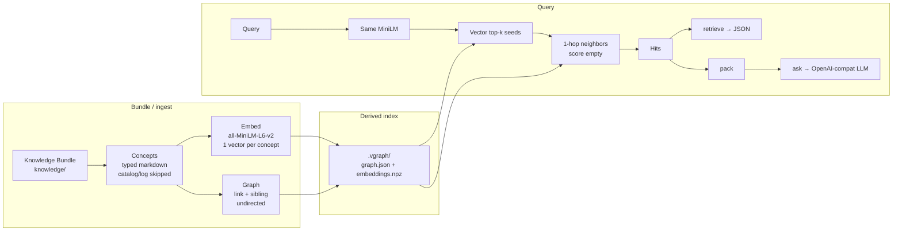

# vgraph_rag

Hybrid graph-vector RAG over an [OKF](knowledge/) v0.2 knowledge bundle.

`knowledge/` is the source of truth (markdown + YAML frontmatter). `.vgraph/` is a derived, gitignored index.



## Setup

```powershell
python -m venv .venv
.\.venv\Scripts\Activate.ps1
pip install -e ".[dev]"
copy .env.example .env
```

Set `OPENAI_API_KEY` in `.env`. Optional: `OPENAI_BASE_URL`, `OPENAI_MODEL` (default `gpt-4o-mini`).

First ingest downloads a local embedding model (`all-MiniLM-L6-v2` via sentence-transformers / PyTorch).

## Commands

```powershell
python -m vgraph ingest
python -m vgraph retrieve "what is this bundle?"
python -m vgraph ask "what is this bundle?"
```

`--bundle` and `--index` default to `knowledge` and `.vgraph`. `ask` / `retrieve` rebuild the index when `knowledge/` is newer.

Human verification of a concept: use the `verify-concept` Cursor skill (stamps `verified` in frontmatter).
