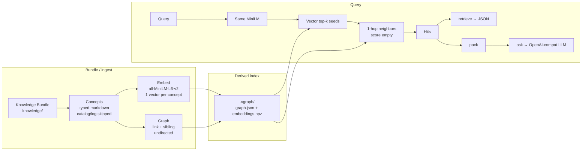

# Hybrid graph-vector RAG

Vector top-k **seeds**, then undirected **1-hop neighbors** (markdown **link** + same-dir **sibling**). `knowledge/` is source of truth; `.vgraph/` is derived.

```mermaid
flowchart LR
  subgraph ingest["Bundle / ingest"]
    KB["Knowledge Bundle<br/>knowledge/"]
    C["Concepts<br/>typed markdown<br/>catalog/log skipped"]
    EMB["Embed<br/>all-MiniLM-L6-v2<br/>1 vector per concept"]
    GR["Graph<br/>link + sibling<br/>undirected"]
    KB --> C --> EMB
    C --> GR
  end

  subgraph idx["Derived index"]
    VG[".vgraph/<br/>graph.json + embeddings.npz"]
  end

  subgraph qry["Query"]
    Q["Query"]
    QE["Same MiniLM"]
    S["Vector top-k seeds"]
    N["1-hop neighbors<br/>score empty"]
    H["Hits"]
    R["retrieve → JSON"]
    PK["pack"]
    LLM["ask → OpenAI-compat LLM"]
    Q --> QE --> S --> N --> H
    H --> R
    H --> PK --> LLM
  end

  EMB --> VG
  GR --> VG
  VG --> S
  VG --> N
```
